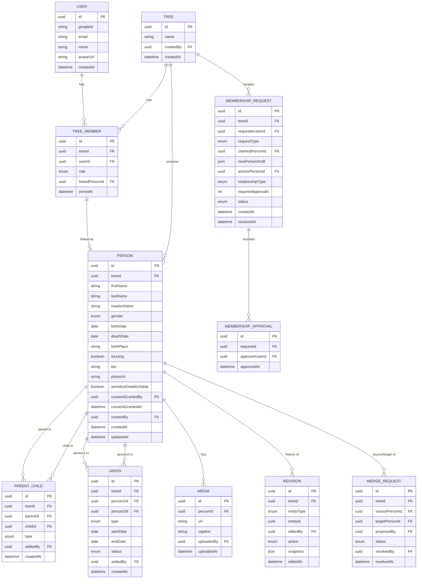

# Data Model — Family Tree App

**Status:** Draft v1.0 · **Last updated:** 2026-07-19
**Related documents:** `ARCHITECTURE.md`, `API_SPEC.md`

## 1. Entity-Relationship Diagram

## 2. Entity Definitions

### User
Represents an authenticated account. Not tree-scoped — one `User` can belong to
multiple trees via `TreeMember`.

| Field | Type | Notes |
|---|---|---|
| id | uuid, PK | |
| googleId | string, unique | From Google OAuth `sub` claim |
| email | string, unique | |
| name | string | |
| avatarUrl | string, nullable | Google profile photo |
| createdAt | datetime | |

### Tree
The isolation boundary. All family data belongs to exactly one tree.

| Field | Type | Notes |
|---|---|---|
| id | uuid, PK | |
| name | string | |
| createdBy | uuid, FK → User | The founder at creation time |
| createdAt | datetime | |

### TreeMember
Join table: which users belong to which trees, with what role, and (optionally)
which `Person` they are.

| Field | Type | Notes |
|---|---|---|
| id | uuid, PK | |
| treeId | uuid, FK → Tree, indexed | |
| userId | uuid, FK → User | |
| role | enum(`FOUNDER`, `ADMIN`, `MEMBER`) | One `FOUNDER` per tree (the creator); `ADMIN`s delegated from it |
| linkedPersonId | uuid, FK → Person, nullable, unique per tree | Which person in this tree is "me" |
| joinedAt | datetime | |

Constraint: `(treeId, userId)` unique — one membership row per user per tree.

### Person
Scoped to exactly one tree — never shared or referenced across trees.

| Field | Type | Notes |
|---|---|---|
| id | uuid, PK | |
| treeId | uuid, FK → Tree, indexed | |
| firstName | string | Always visible regardless of consent gating |
| lastName | string, nullable | Gated — see `sensitiveDetailsVisible` |
| maidenName | string, nullable | Gated |
| gender | enum | |
| birthDate | date, nullable | Gated |
| deathDate | date, nullable | Not gated (deceased-only field) |
| birthPlace | string, nullable | |
| isLiving | boolean | Drives consent-gating rules (`ARCHITECTURE.md` §5.5) |
| bio | string, nullable | |
| photoUrl | string, nullable | Gated |
| sensitiveDetailsVisible | boolean, default `false` | Gates `photoUrl`, `lastName`, `maidenName`, `birthDate` together |
| consentGrantedBy | uuid, FK → User, nullable | Self (if linked) or proxy grantor (deceased only) |
| consentGrantedAt | datetime, nullable | |
| createdBy | uuid, FK → User | |
| createdAt / updatedAt | datetime | |

### ParentChild
Directed edge, parent → child, within one tree.

| Field | Type | Notes |
|---|---|---|
| id | uuid, PK | |
| treeId | uuid, FK → Tree, indexed | |
| parentId | uuid, FK → Person | |
| childId | uuid, FK → Person | |
| type | enum(`BIOLOGICAL`, `ADOPTED`, `STEP`, `FOSTER`) | |
| addedBy | uuid, FK → User | |
| createdAt | datetime | |

Constraint: `parentId != childId`; both must belong to the same `treeId` as the edge.

### Union
Spouse/partner edge, within one tree.

| Field | Type | Notes |
|---|---|---|
| id | uuid, PK | |
| treeId | uuid, FK → Tree, indexed | |
| person1Id / person2Id | uuid, FK → Person | Unordered pair |
| type | enum(`MARRIAGE`, `PARTNERSHIP`) | |
| startDate / endDate | date, nullable | |
| status | enum(`CURRENT`, `DIVORCED`, `WIDOWED`) | |
| addedBy | uuid, FK → User | |
| createdAt | datetime | |

### Revision
Append-only audit/history log. Never updated or deleted.

| Field | Type | Notes |
|---|---|---|
| id | uuid, PK | |
| treeId | uuid, FK → Tree, indexed | |
| entityType | enum(`PERSON`, `PARENT_CHILD`, `UNION`, `TREE_MEMBER`) | |
| entityId | uuid | Polymorphic reference |
| editedBy | uuid, FK → User | |
| action | enum(`CREATE`, `UPDATE`, `DELETE`) | |
| snapshot | json | Full entity state after the action |
| editedAt | datetime | |

### MergeRequest
Proposes combining two `Person` records within the same tree.

| Field | Type | Notes |
|---|---|---|
| id | uuid, PK | |
| treeId | uuid, FK → Tree, indexed | |
| sourcePersonId / targetPersonId | uuid, FK → Person | Both must share `treeId` |
| proposedBy | uuid, FK → User | |
| status | enum(`PENDING`, `APPROVED`, `REJECTED`) | |
| resolvedBy | uuid, FK → User, nullable | |
| resolvedAt | datetime, nullable | |

### MembershipRequest / MembershipApproval
The join-request workflow (`ARCHITECTURE.md` §5.3).

| Field | Type | Notes |
|---|---|---|
| id | uuid, PK | |
| treeId | uuid, FK → Tree, indexed | |
| requesterUserId | uuid, FK → User | |
| requestType | enum(`NEW_PERSON`, `CLAIM_EXISTING`) | |
| claimedPersonId | uuid, FK → Person, nullable | Set when `CLAIM_EXISTING` |
| newPersonDraft | json, nullable | Set when `NEW_PERSON` |
| anchorPersonId | uuid, FK → Person | Person the requester claims a relationship to |
| relationshipType | enum | e.g. `CHILD_OF`, `SPOUSE_OF` |
| requiredApprovals | int | `1` for `NEW_PERSON`, `2` for `CLAIM_EXISTING` |
| status | enum(`PENDING`, `APPROVED`, `REJECTED`) | |
| createdAt / resolvedAt | datetime | |

`MembershipApproval`: `id`, `requestId` (FK), `approverUserId` (FK), `approvedAt`.

### Media
Photos/documents attached to a person (V2).

| Field | Type | Notes |
|---|---|---|
| id | uuid, PK | |
| personId | uuid, FK → Person | |
| url | string | Signed/private storage URL |
| caption | string, nullable | |
| uploadedBy | uuid, FK → User | |
| uploadedAt | datetime | |

## 3. Indexing Notes

- `treeId` indexed on every tree-scoped table — it's the primary filter on
  every query in the system.
- `(treeId, userId)` unique on `TreeMember`.
- `(treeId, linkedPersonId)` unique on `TreeMember` where not null.
- `(parentId)` and `(childId)` indexed on `ParentChild` for ancestor/descendant
  lookups within a tree.
- `(entityType, entityId)` indexed on `Revision` for per-entity history lookups.
